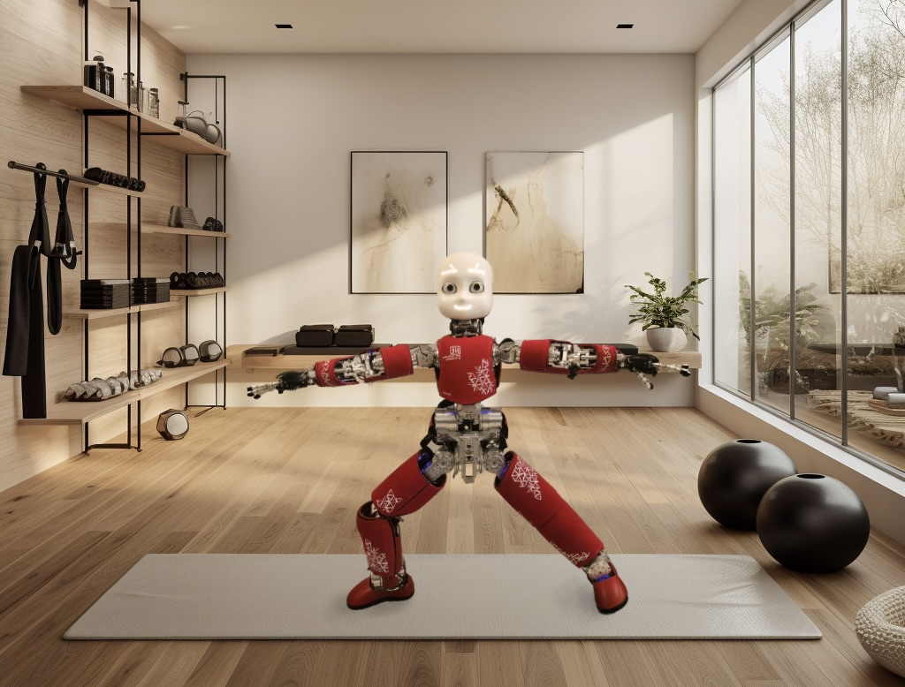
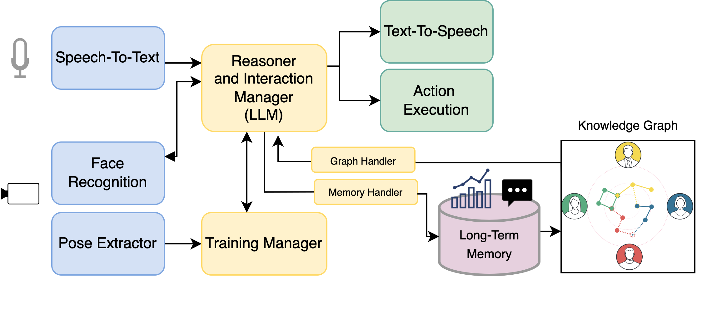

# 🧘 Yoga Teacher LLM  

<div align="center">
  
</div>
<br>

This project designs an advanced architecture for the iCub robot, combining Large Language Models (LLMs) with Knowledge Graphs. This enables it to handle social interactions, achieve goals, and autonomously build long-term memory and knowledge through user interactions.

The Yoga Teacher demonstrates yoga poses at different difficulty levels, provides real-time feedback, and stores performance and interaction data in its long-term memory.

## 🌟 Key Features

- Leverages LLMs (in this case, GPT-4o-mini) for advanced social interaction processing.
- Autonomously builds Knowledge Graphs hosted in a Neo4j Aura database.
- Stores raw user conversations, interaction summaries, and performance metrics.
- Supports real-time interaction using speech-to-text and processes input from robot cameras. It also offers a debug mode using keyboard inputs and a webcam.
- Provides real-time pose demonstrations with adjustable difficulty levels and real-time feedback.

<div align="center">
  
  <figcaption>Architecture overview. The current project implements the behavioral and reasoning 
backbone of the robot (yellow modules) and create the Long-Term Memory Database and the Knowledge Graph</figcaption>
</div>
<br>


For more details about the architecture check the [documentation](docs/architecture_details.md).

---

## 🗂 Memories Directory Structure and Outputs

The Yoga Teacher organizes its memory into a structured folder system to retain conversation history and performance metrics. 
The stored files include the _raw conversation history_, a _summary of the conversation_, the _raw performance table_, and a _meta performance table_.

The memory folder tree is as follows:

    memory_path
    ├── user_name
    │   ├── interaction_of_date_time
    │   │   ├── Raw_Chat.txt
    │   │   ├── Summary.txt
    │   │   ├── Raw_Performance.csv
    │   │   ├── Meta_Performance.csv
    │   │   └── experiment_log.txt

An example of generated ```memory folder``` can be found [here](yoga_tutor_memories). 
Moreover, a graph is extracted and uploaded on the online database hosted by [neo4j aura](https://neo4j.com/product/auradb/).

---

## 💻 Installation Guide
### 1) Clone and install
Clone this repo, ideally in the `usr/local/src/robot/cognitiveInteraction` folder.

```bash
cd ../Yoga-Teacher-LLM

mkdir build && cd build

cmake .. /
make install
```

<details>
<summary><b>What happend?</b></summary>

1) We created a _virtual env_ in the build folder.
2) An executable .sh script has been added to the iCubContrib folder. This script activates the virtual env and runs the module.

Now every time you modify your code placed in `\cognitiveInteraction` all the changes affect the installed app you are used to run from yarpmanager.

**NO NEED TO REBUILD/PYINSTALL THE WHOLE PROJECT.** 😎
</details>

### 2) Add OPENAI API keys 
The Yoga Teacher relies on OPENAI's API, you then have to export your credentials as env varibales. \

To configure it:  
1. Fill in your credentials in the included `.env_template` file (under `/modules/llmYogaTeacher/`).  
2. Rename this file to `.env`.  

*No worries! Your credentials won't be committed to Git as they're ignored in `.gitignore`.*

---

## 🧘‍♀️ How to run

1. Open **Yarp Manager**.
2. Look for the `Yoga Teacher LLM` app.
3. Run all modules and connect all ports. 

The robot will start talking as soon as someone gets close to it.

---

## 📨 Available Ports

Below are the ports utilized by the Yoga Teacher system:

| Port Name                      | Functionality                              |
|--------------------------------|-------------------------------------------|
| `/llmYogaTeacher`              | Base port for commands                    |
| `/llmYogaTeacher/speech_recognition:i` | Speech input                           |
| `/llmYogaTeacher/image:i`      | Image input, e.g., gestures               |
| `/llmYogaTeacher/faceID:i`     | Input for face ID                         |
| `/llmYogaTeacher/name:o`       | Outputs recognized name                   |
| `/llmYogaTeacher/thr:o`        | Outputs threshold values                  |
| `/llmYogaTeacher/speak:o`      | Output for speech                         |
| `/llmYogaTeacher/action:o`     | Pose/action execution                     |
| `/llmYogaTeacher/image:o`      | Outputs processed image stream            |

---

## Supported RPC Commands

Send the following RPC commands to the base `/llmYogaTeacher` handler port:

- **Set Pose**: `set pose <pose_name>`  
- **Set Threshold**: `set threshold <int>`  
- **Get Pose**: `get pose`  
- **Get Threshold**: `get threshold`

---

## 🤸 Poses
The iCub robot can demonstrate yoga poses each categorized into 3 levels of difficulty:  

<details>
<summary><b>Level 1: Easy Poses</b></summary>

1. Warrior (`guerriero_pose`)  
2. Airplane (`aeroplano_pose`)  
3. Crab (`granchio_pose`)  

</details>

<details>
<summary><b>Level 2: Intermediate Poses</b></summary>

4. Fighter (`lottatore_pose`)  
5. Tree (`albero_pose`)  
6. Flamingo (`fenicottero_pose`)  

</details>

<details>
<summary><b>Level 3: Advanced Poses</b></summary>

7. Cactus (`cactus_pose`)  
8. Wheel (`ruota_pose`)  
9. Triangle (`triangolo_pose`)  

</details>

---
## 🔄 Changelog

<details>
<summary>Click to expand the changelog</summary>

1. New README.  
2. Major code optimizations and cleanup.  
3. Added command-line parameter parsing.  
4. Integrated **knowledge retriever and builder** into the `KnowledgeGraph` class for easier I/O.  
5. Neo4J database is now hosted online!  
6. Improved performance and refined meta performance table.  
7. Interaction handling via keyboard has been massively enhanced.  
8. Moved from GPT 3.5 to GPT-4o mini.
9. Fake Agent.py will simulate infinite interactions for us. 
10. We build graph from summary.txt

</details>

---
## 👥 Authors and Acknowledgment
### Code developed and mantained by: 

Luca Garello (luca.garello@iit.it) and Giulia Belgiovine (giuliabelgiovine@gmail.com) 

Acknowledgments: 
Thanks to Gabriele Russo for his work and contribution to the project during his master thesis work.
Thanks to Jonas Gonzalez for his earlier contribution to the project's development.

---
## 📜 License

Copyright: (C) 2022 Robotics Brain and Cognitive Sciences
Permission is granted to copy, distribute, and/or modify this program under the terms of the GNU General Public License, version 2 or any later version published by the Free Software Foundation.

A copy of the license can be found at http://www.robotcub.org/icub/license/gpl.txt
