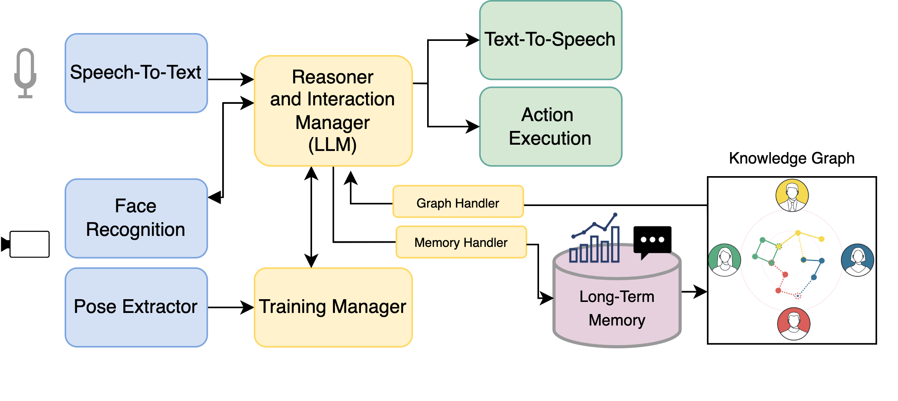

# 🧘 Yoga Teacher LLM: Architecture Documentation

---

## Architecture Overview
To develop a robot tutor capable of autonomously engaging in social interactions while efficiently managing the tutoring pipeline, we designed the software architecture shown in the figure below.

The architecture enables the iCub robot to perform the following tasks:

1. Engage in natural, dynamic conversations with users.
2. Prioritize and manage key components of tutoring interactions.
3. Autonomously create and retrieve both user-specific and general knowledge.

The software architecture is built on YARP middleware, which facilitates communication and task coordination across modules. 
It includes components written in C++ and Python. The architecture consists of the following categories of modules:

- Perception Modules
- Action Modules
- Main Modules (for Reasoning and Interaction Handling)
- Memory and Knowledge Graph Databases
Below is a visual representation of the architecture. In the current project, the Main Modules (for Reasoning and Interaction Handling) and the Memory Structure (Long-Term Memory database and Knowledge Graph) are implemented.

---

## Perception Modules

These modules enable the robot to perceive its environment and users by processing multi-modal data from its sensors

### Components:
- **SpeechToText**: Converts user speech into text using OpenAI's state-of-the-art Whisper model (`small-distil`). It supports multiple languages.
- **Face Recognizer**: Detects and identifies users' faces using the Ultralytics YOLOv8 model. It compares face embeddings with a stored database to determine if the user has previously interacted with the robot.  
- **Pose Estimation**: Tracks users' body poses through the YOLOv11-pose model, identifying 17 keypoints.

---

## Action Modules
These modules allow the robot to interact with users through **speech** and **physical movements**.

### Components:
- **Body Motion**: Controls the robot's movements, enabling it to:
  - Perform yoga poses with motor feedback.
  - Control neck/head motion using the iKinGazeCtrl module for gaze control.
  - Display facial expressions via LED activation.  

- **TextToSpeech**: Converts LLM-generated text into spoken messages using _Acapela Text-To-Speech_.

---

## Main Modules (for Reasoning and Interaction Handling)
These modules manage the robot's ability to reason, interact socially, supervise training sessions, and handle memory.

### Components:
- **Trainer**:
  - Analyzes user joint angles via the Pose Estimation module.
  - Evaluates poses by comparing the user's joint angles to target poses, within an adjustable error threshold.
  - Provides **physical demonstrations** and **verbal feedback** to help users correct poses.
  - (Refer to trainer.py and pose.py)

  
- **Reasoner**:
  - Acts as the central orchestrator of all modules, managing communication via the YARP system.  
  - Utilizes a built-in **LLM agent** to decide the most appropriate action to perform based on:
    - Real-time input (e.g., user speech and poses).
    - Context (e.g., short-term memory)
    - Long-term memory data (e.g., from the Knowledge Graph).
    - (Refer to main.py and llm_agent.py)

- **Memory Handler**:
  - Responsible for creating/retrieving files and folders in the long-term memory database.
  - (Refer to memory_handler.py)
  
---

## **Memory Structure**
### Components:
- **Database**: Stores:
  1. **Face Data**: Recognized users who have interacted with the robot.
  2. **Textual Memories**: Files containing conversations and summaries with relevant extracted information.
  3. **Performance Metrics**: CSV files documenting training performance.

- **Knowledge Graph**: 
  - Represents long-term knowledge generated through user interaction. 
  - Stored as a graph in the **Neo4j Aura** database.
  - (Refer to knowledge_graph.py)

Below an example of Knowledge Graph:

#### Knowledge Graph example

---

## **Fake User Module**

The Fake User Module is designed to simulate user interactions with the Yoga Teacher, making it possible to test and validate the robot's features and performance in a controlled environment. 
The output of this module is stored in the _fake summary_ folder, which mimics the interaction outcome of real users.

### Functionality:
- Simulates a hypothetical user interacting with the iCub robot in a natural and controlled way.
- Automatically generates responses to the robot’s messages based on predefined user profiles.
- Helps in testing the **interaction pipeline** and **training evaluation** process without requiring real users.
- (Refer to fake_user.py)

---

Below are some figure related to the LLM Agent:

#### Tool Choice

#### Structured Prompt Template

#### Desired Interaction Pipeline

